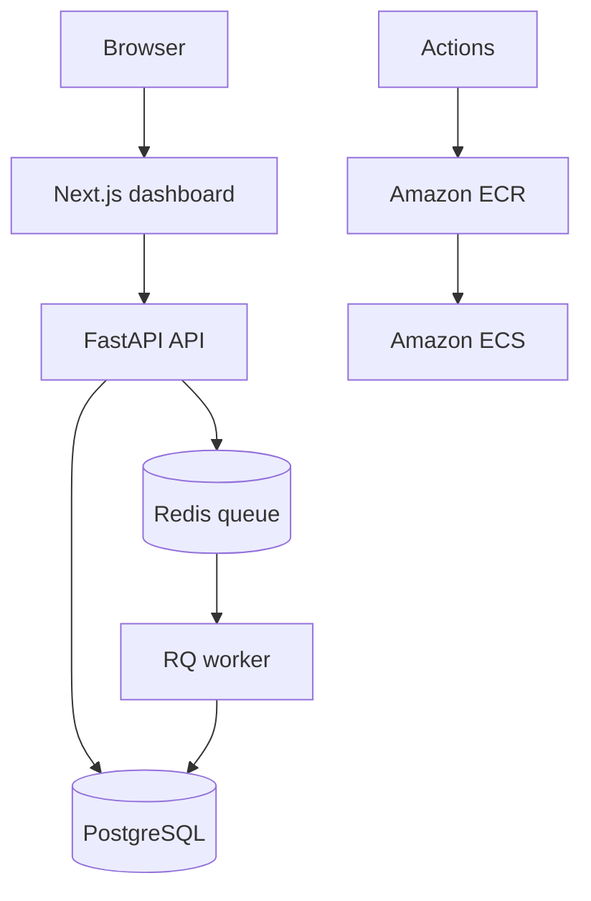

# CustomWear Analytics

A full-stack customer analytics platform for an apparel brand. The Next.js dashboard turns transaction data into customer segments, revenue trends, retention opportunities, and purchasing-behavior insights backed by FastAPI, PostgreSQL, and Redis.

[Live dashboard](https://customwear-analytics-dashboard.achan7632917.chatgpt.site) · [FastAPI docs after local startup](http://localhost:8000/docs)

## What it does

- Presents a responsive analytics dashboard with revenue, retention, category, and segment insights
- Searches and filters customer profiles with detailed RFM behavior scores
- Imports apparel transaction CSVs with schema validation and idempotent ingestion
- Runs customer segmentation synchronously or as a Redis-backed background job
- Persists timestamped segment snapshots and customer metrics in PostgreSQL
- Ships with Docker Compose, Alembic migrations, frontend and backend tests, GitHub Actions, and Amazon ECR/ECS deployment configuration

## Segments

| Segment | Interpretation |
|---|---|
| Champions | Recent, frequent, high-spend customers |
| Loyal Customers | Repeat customers with strong frequency and value |
| Big Spenders | High monetary value, regardless of frequency |
| At Risk | Previously valuable customers whose activity has declined |
| Promising | Recent customers beginning to engage |
| New Customers | First-time or very low-frequency recent buyers |
| Hibernating | Customers with old, infrequent, low-value activity |
| Needs Attention | Customers outside the stronger behavioral groups |

## Quick start

1. Copy the environment file:

   ```bash
   cp .env.example .env
   ```

2. Start the dashboard, API, worker, PostgreSQL, and Redis:

   ```bash
   docker compose up --build
   ```

3. Open the dashboard at `http://localhost:3000` and API documentation at `http://localhost:8000/docs`.

4. Seed demo transactions and build the first segment snapshot:

   ```bash
   docker compose exec api python scripts/seed_demo.py
   curl -X POST http://localhost:8000/api/v1/segments/run
   ```

5. Connect directly to PostgreSQL when you want to inspect stored data:

   ```bash
   docker compose exec postgres psql -U analytics -d analytics
   ```

   Inside `psql`, run `\dt` to list analytics tables or query the latest segments:

   ```sql
   SELECT customer_id, segment, monetary_value
   FROM customer_segments
   ORDER BY run_id DESC, monetary_value DESC;
   ```

## Dashboard

The `frontend/` application includes:

- Overview KPIs and a weekly revenue trend
- RFM customer-segment distribution and segment value
- Product-category affinity and retention recommendations
- Searchable customer profiles with a detailed customer drawer
- CSV transaction import with loading, error, and success states
- Live API connectivity with a polished demo-data fallback
- Responsive navigation and keyboard-accessible interactions

Set `NEXT_PUBLIC_API_BASE_URL` in `frontend/.env` when the dashboard and API are hosted separately.

## Database migrations

The API container automatically runs pending Alembic migrations before it starts. For local development outside Docker, run:

```bash
alembic upgrade head
```

Create a migration after changing the SQLAlchemy models with:

```bash
alembic revision --autogenerate -m "describe the schema change"
```

## Main API routes

- `POST /api/v1/transactions` - ingest one transaction
- `POST /api/v1/transactions/batch` - ingest up to 5,000 transactions
- `POST /api/v1/segments/run?background=true` - enqueue segmentation
- `GET /api/v1/segments/summary` - view the latest segment distribution
- `GET /api/v1/customers` - list, search, filter, and paginate the latest profiles
- `GET /api/v1/customers/{customer_id}` - retrieve a customer's metrics and segment
- `GET /api/v1/jobs/{job_id}` - inspect an asynchronous job
- `GET /health/live` and `GET /health/ready` - container health endpoints

## Architecture



The hosted dashboard calls the FastAPI ingestion and analytics routes, with local demo data available when no API URL is configured. The API stores raw transactions immediately, while a segmentation run aggregates them into RFM features and writes an immutable snapshot. Redis isolates longer analytics work from API traffic, and PostgreSQL retains both operational records and historical segment output. GitHub Actions independently validates the frontend and PostgreSQL-backed API before the versioned API image is released to ECR and ECS.

## Development

Backend:

```bash
python -m venv .venv
source .venv/bin/activate
pip install -r requirements-dev.txt
cp .env.example .env
pytest
ruff check .
```

Frontend:

```bash
cd frontend
cp .env.example .env
npm ci
npm run lint
npm test
```

Local backend tests can use SQLite for speed. GitHub Actions provisions PostgreSQL 16, applies every migration, and runs the API suite against it. The frontend suite performs a production build and verifies rendered content, accessibility landmarks, core workflows, responsive styles, and social metadata.
