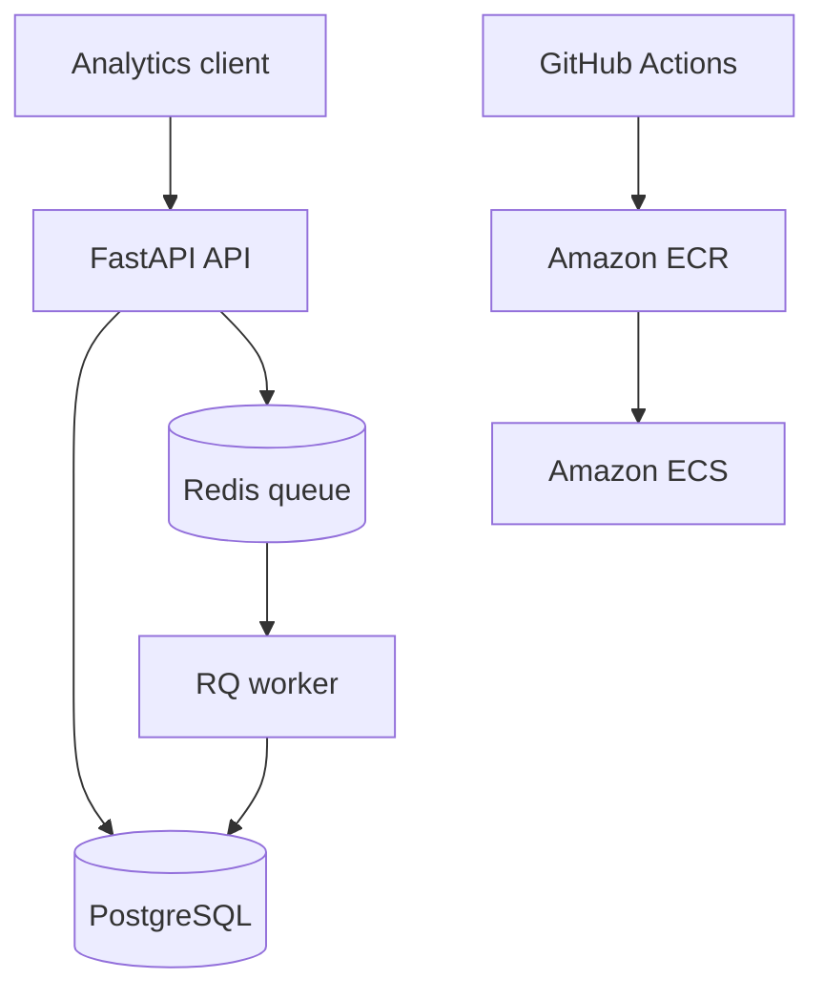

# CustomWear Analytics

A production-oriented customer analytics backend for an apparel brand. The API ingests transaction data, computes customer-level RFM metrics (recency, frequency, and monetary value), and persists actionable customer segments for targeting and retention campaigns.

## What it does

- Ingests individual or batched apparel transactions with idempotency protection
- Runs customer segmentation synchronously or as a Redis-backed background job
- Persists segment snapshots and customer metrics in PostgreSQL
- Exposes segment summaries and customer profiles through FastAPI
- Ships with Docker Compose, tests, GitHub Actions, and an Amazon ECR/ECS deployment workflow

## Segments

| Segment | Interpretation |
|---|---|
| Champions | Recent, frequent, high-spend customers |
| Loyal Customers | Repeat customers with strong frequency and value |
| Big Spenders | High monetary value, regardless of frequency |
| At Risk | Previously valuable customers whose activity has declined |
| Promising | Recent customers beginning to engage |
| New Customers | First-time or very low-frequency recent buyers |
| Hibernating | Customers with old, infrequent, low-value activity |
| Needs Attention | Customers outside the stronger behavioral groups |

## Quick start

1. Copy the environment file:

   ```bash
   cp .env.example .env
   ```

2. Start the API, worker, PostgreSQL, and Redis:

   ```bash
   docker compose up --build
   ```

3. Open the API docs at `http://localhost:8000/docs`.

4. Seed demo transactions and build the first segment snapshot:

   ```bash
   docker compose exec api python scripts/seed_demo.py
   curl -X POST http://localhost:8000/api/v1/segments/run
   ```

5. Connect directly to PostgreSQL when you want to inspect the stored data:

   ```bash
   docker compose exec postgres psql -U analytics -d analytics
   ```

   Inside `psql`, run `\dt` to list the analytics tables or query the latest segments:

   ```sql
   SELECT customer_id, segment, monetary_value
   FROM customer_segments
   ORDER BY run_id DESC, monetary_value DESC;
   ```

## Database migrations

The API container automatically runs pending Alembic migrations before it starts. For local development outside Docker, run:

```bash
alembic upgrade head
```

Create a migration after changing the SQLAlchemy models with:

```bash
alembic revision --autogenerate -m "describe the schema change"
```

## Main API routes

- `POST /api/v1/transactions` - ingest one transaction
- `POST /api/v1/transactions/batch` - ingest up to 5,000 transactions
- `POST /api/v1/segments/run?background=true` - enqueue segmentation
- `GET /api/v1/segments/summary` - view the latest segment distribution
- `GET /api/v1/customers/{customer_id}` - retrieve a customer's metrics and segment
- `GET /api/v1/jobs/{job_id}` - inspect an asynchronous job
- `GET /health/live` and `GET /health/ready` - container health endpoints

## Architecture



The API stores raw transactions immediately. A segmentation run aggregates them into RFM features, assigns deterministic behavioral segments, and writes a timestamped snapshot so historical model outputs remain auditable.

## Development

```bash
python -m venv .venv
source .venv/bin/activate
pip install -r requirements-dev.txt
cp .env.example .env
pytest
ruff check .
```

Local unit tests can use SQLite for speed. GitHub Actions provisions PostgreSQL 16, applies every migration, and runs the full API test suite against it so PostgreSQL compatibility is continuously verified.

